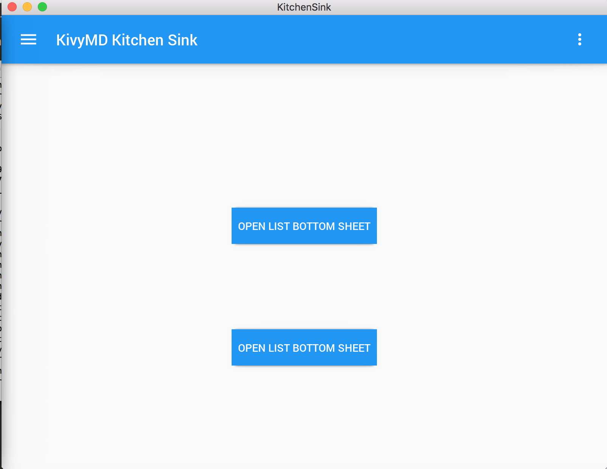
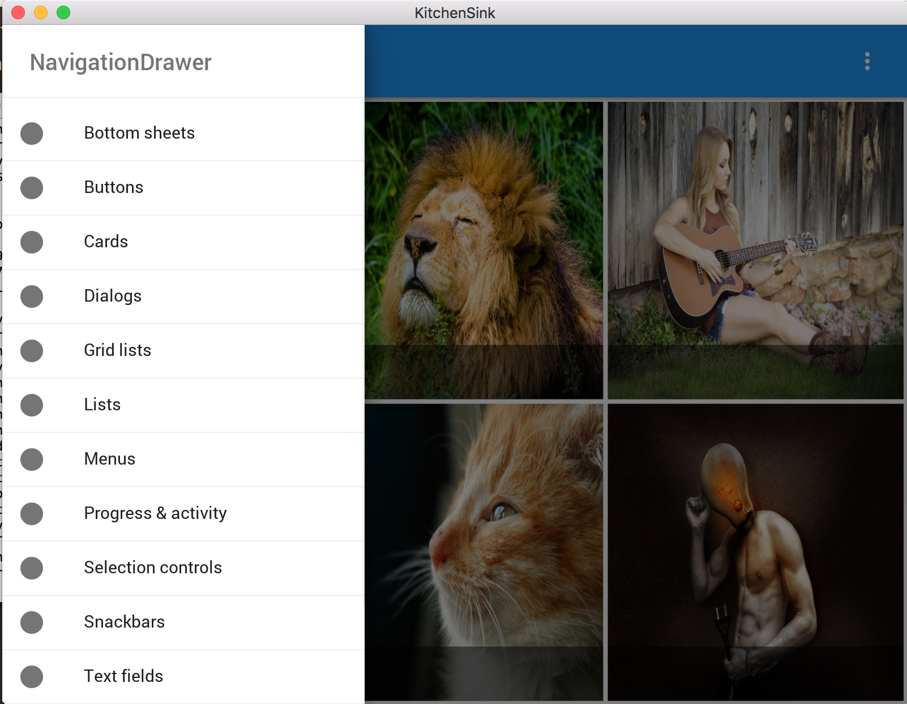

# KyvyMD

[Kivy](https://kivy.org/#home)是一个基于python的跨平台应用开发框架。它同时支持Linux, Windows, OS X, Android和iOS，并且能够识别大部分的操作。
而[kivyMD](https://gitlab.com/kivymd/KivyMD)则是一个基于kivy的一个扩展包，它的目的是提供一个类似于Google Material Design的一套控件，这样，使用者就可以方便的将android上的Material Design效果移植到其他的平台上去。

## 安装

首先，本次安装过程要求全程翻墙，否则无法下载对应的控件。

那么第一步，是kivy的安装，可以参照https://kivy.org/#download，根据自己的平台去做相应的操作。这里以mac下python2.7为例：

- 首先下载mac下2.7对应的安装包
- 下载完成后，解压缩文件，可以得到Kivy2.app
- 执行命令`sudo mv Kivy2.app /Applications/Kivy.app`添加到应用列表中去
- 添加链接命令到/usr/local/bin下`ln -s /Applications/Kivy.app/Contents/Resources/script /usr/local/bin/kivy`
- 安装KivyMD的一个依赖module`kivy -m pip install kiva-garden`（如果安装不成功，可以尝试直接`pip install kivy-garden`）
- 安装garden这个module的一个子module`garden install recycleview`

再次提醒，以上步骤必须翻墙，否则无法安装成功。

安装完成后，从gitlab上把KivyMD clone下来：`git clone https://gitlab.com/kivymd/KivyMD.git`，然后执行`python setup.py install`就可以完成KivyMD的安装了。

最后测试：`python kitchen_sink.py`就能够看到demo界面了。

